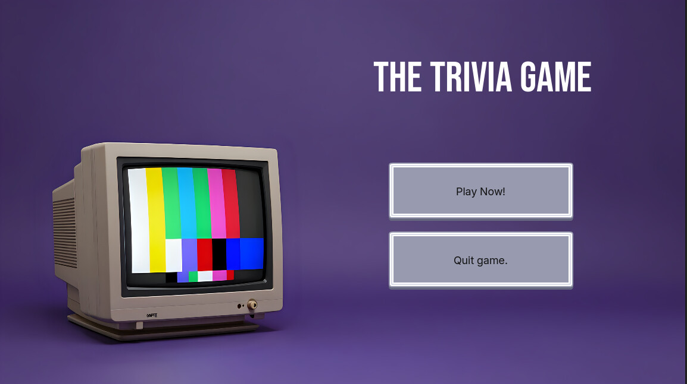

# Trivia Coding Challenge

The trivia experience built with Godot 4.

## ✨ Features
- **Real-time Data:** OpenTDB Api-fetching and sanitization of trivia data, handling Base64 encoding and HTML entities for seamless readability.
- **Difficulty selection:** Users decide between-easy, medium, & hard.
- **Category selection:** Up to six categories to choose from.

## 🚀 Getting Started
1. Navigate to the **Releases** tab on the right.
2. Download the executable for your operating system.
3. Launch and begin your trivia game.

> **Developer Note:** This project was built with Godot 4.x. To explore the source, clone the repository and import `project.godot` into the Godot Engine.

Built with Godot 4.0--feel free to clone repository and import the project and have a look around.

## What to add Next
- **Code Refinement:** I had to crunch to get it completed in time--there's some optimization to be done.
- **Granular Categories:** Break down "Entertainment" into specific sub-genres (Film, Music, Books).
- **AI-Powered Trivia:** Integrate a Large Language Model (LLM) API to allow users to generate custom trivia categories on the fly.
- **Juice & Polish:** Add staggered button animations and screen-shake transitions for high-impact feedback.
